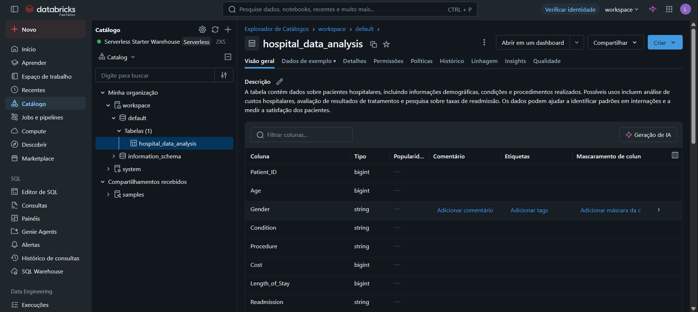
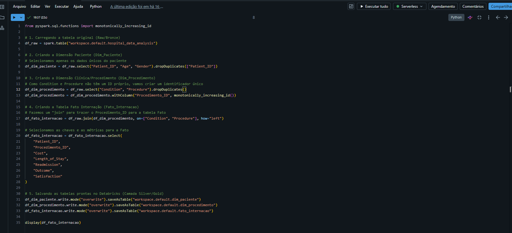
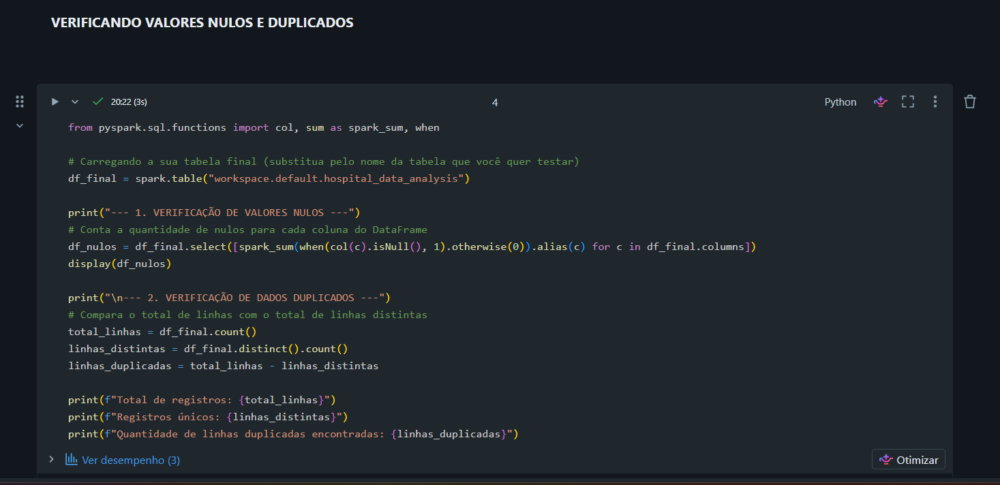
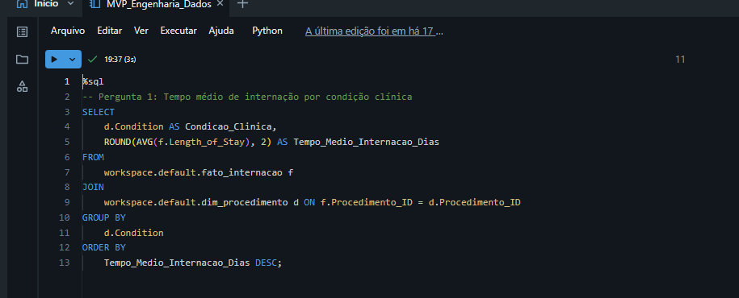
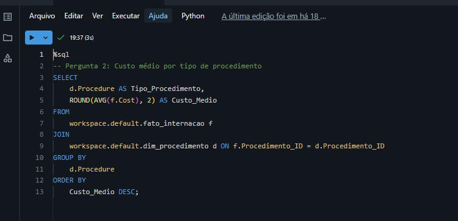
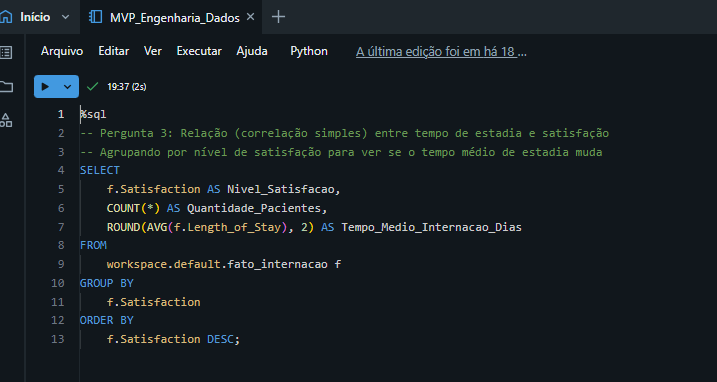
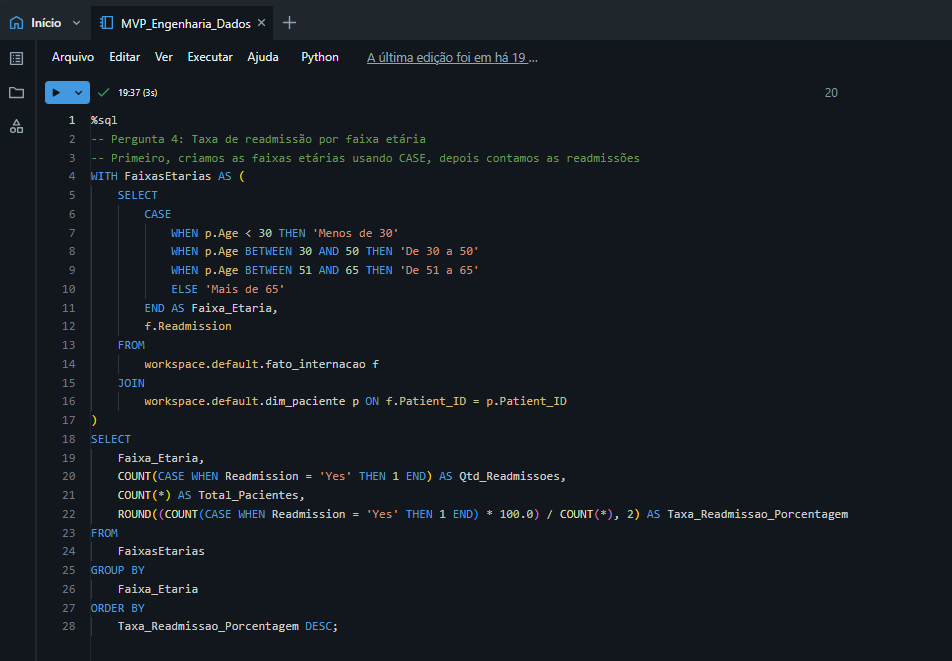
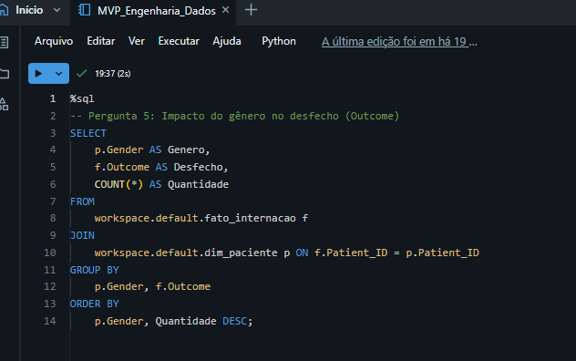

# MVP | Engenharia de Dados | Pós-Graduação em Ciência de Dados e Analytics

## Apresentação
Este repositório contém o Minimum Viable Product (MVP) desenvolvido para a disciplina de Engenharia de Dados da Pós-Graduação em Ciência de Dados e Analytics da PUC-Rio. O objetivo deste projeto é construir um pipeline de dados completo utilizando tecnologias na nuvem, contemplando as etapas de busca, coleta, modelagem, carga e análise dos dados. Todo o desenvolvimento foi realizado na plataforma **Databricks** (Community Edition).

---

## 1. Objetivo
Antes da ingestão dos dados, o escopo do projeto foi definido com foco em extrair inteligência de negócios a partir de uma base de dados hospitalar fictícia. O projeto visa responder às seguintes perguntas estratégicas para a gestão do hospital:

1. Qual condição de saúde gera o maior tempo médio de internação?
2. Qual é o custo médio de cada tipo de procedimento realizado?
3. Existe uma relação entre o tempo de estadia e a satisfação do paciente?
4. Qual faixa etária tem a maior taxa de readmissão?
5. Como o gênero impacta o desfecho do tratamento?

---

## 2. Coleta e Armazenamento
Os dados utilizados consistem em uma base hospitalar fictícia estruturada em formato `.csv` (contendo 1000 registros originais). A coleta foi realizada de forma direta (upload manual) e os dados foram armazenados de forma persistente na nuvem através do **DBFS (Databricks File System)**, atuando como a nossa camada Raw/Bronze.

---

## 3. Modelagem e Catálogo de Dados
Para otimizar as consultas e simular um ambiente analítico (Data Warehouse), os dados passaram por uma modelagem dimensional em **Esquema Estrela (Star Schema)**. A tabela original (flat) foi dividida em três tabelas: duas Dimensões e uma Fato.

### Catálogo de Dados (Dicionário)
* **Origem/Linhagem:** Arquivo CSV inserido no DBFS e transformado via PySpark.

**Tabela: `dim_paciente` (Dimensão)**
* **Patient_ID:** Identificador único do paciente. *(Numérico | Min: 1 / Max: 1000)*
* **Age:** Idade do paciente na admissão. *(Numérico | Min: 25 / Max: 78)* 
* **Gender:** Gênero biológico/identidade. *(Categórico | Valores: Female, Male)*

**Tabela: `dim_procedimento` (Dimensão)**
* **Procedimento_ID:** Chave primária artificial gerada no ETL. *(Numérico)*
* **Condition:** Condição clínica de entrada. *(Categórico | Valores de 'Allergic Reaction' a 'Stroke')*
* **Procedure:** Tratamento realizado. *(Categórico | Valores de 'Angioplasty' a 'X-Ray and Splint')*

**Tabela: `fato_internacao` (Fato)**
* **Patient_ID:** Chave estrangeira (FK).
* **Procedimento_ID:** Chave estrangeira (FK).
* **Cost:** Custo total do procedimento. *(Numérico | Min: 100 / Max: 25.000)*
* **Length_of_Stay:** Tempo de internação em dias. *(Numérico | Min: 1 / Max: 76)*
* **Satisfaction:** Satisfação do paciente. *(Numérico | Min: 2 / Max: 5)*
* **Readmission:** Indicador de retorno ao hospital. *(Categórico | Valores: No, Yes)*
* **Outcome:** Desfecho clínico. *(Categórico | Valores: Recovered, Stable)*

---

## 4. Carga (ETL)
A extração, transformação e carga (ETL) foram realizadas utilizando a linguagem **PySpark** dentro de Notebooks no Databricks. O processo incluiu a remoção de duplicatas, geração de chaves primárias artificiais (`monotonically_increasing_id`) e a junção dos conjuntos de dados para formar as tabelas `dim_paciente`, `dim_procedimento` e `fato_internacao`.

---

## 5. Análise de Dados

### 5.1. Qualidade de Dados
Durante a fase de exploração, foi realizada uma análise da qualidade para cada atributo do conjunto de dados. Através da execução de rotinas de validação em PySpark, avaliou-se a integridade da base original e demonstrou-se que não foram encontrados problemas. O algoritmo confirmou a ausência total de valores nulos (missing values) e a inexistência de registros duplicados. Como a base já se encontrava consistente, não foi necessária a aplicação de técnicas de limpeza ou deleção de registros, garantindo que nenhuma anomalia afete as respostas que solucionarão o problema de negócio.

### 5.2. Solução do Problema
Com os dados limpos e modelados, utilizamos a linguagem **SQL** diretamente no Databricks para responder às perguntas de negócio definidas no objetivo[cite: 2].

**Pergunta 1: Qual condição de saúde gera o maior tempo médio de internação?**

* **Discussão:** Os dados revelam que as condições oncológicas (Câncer e Câncer de Próstata) e eventos cardiovasculares ou neurológicos agudos (Ataque Cardíaco e AVC) são os maiores consumidores de tempo de leito hospitalar, com médias superiores a 40 dias. Para a gestão estratégica do hospital, isso indica que o planejamento de capacidade, a alocação de equipes de enfermagem especializadas e a previsão de custos devem focar prioritariamente nestes setores de alta complexidade. Em contrapartida, condições como reações alérgicas e fraturas de braço apresentam giros de leito mais rápidos, permitindo maior rotatividade e liberação de espaço na unidade.

**Pergunta 2: Qual é o custo médio de cada tipo de procedimento realizado?**

* **Discussão:** O resultado demonstra que os procedimentos associados a áreas de alta complexidade, como "Surgery and Chemotherapy" (Cirurgia e Quimioterapia) e "Radiation Therapy" (Radioterapia), representam o maior encargo financeiro, atingindo patamares em torno dos 25.000 e 20.000, respetivamente. Intervenções cardiológicas, como o Cateterismo Cardíaco e a Angioplastia, também se destacam com custos elevados (entre 15.000 e 18.000). Em contrapartida, tratamentos de rotina ou intervenções simples (como injeções de epinefrina, medicação e raio-X) têm um custo médio residual. Do ponto de vista da gestão e administração hospitalar, esta análise é crucial, pois indica que a alocação de orçamento e o planeamento financeiro devem focar-se substancialmente nas alas de oncologia e cardiologia, que absorvem a maior fatia do capital.

**Pergunta 3: Existe uma relação entre o tempo de estadia e a satisfação?**

* **Discussão:** Sim, os dados demonstram uma relação inversamente proporcional entre o tempo de estadia e a satisfação do paciente. Pacientes que reportam o nível máximo de satisfação (nível 5) apresentam o menor tempo médio de internamento (34,25 dias). À medida que o tempo de estadia aumenta, a satisfação cai progressivamente, atingindo o nível mais baixo (nível 2) nos pacientes com os internamentos mais longos (média de 40,67 dias). Para a gestão hospitalar, isto indica que otimizar os processos de recuperação e acelerar as altas seguras não é apenas uma questão de redução de custos, mas também um fator crítico para melhorar a experiência e a perceção de qualidade por parte dos doentes.

**Pergunta 4: Qual faixa etária tem a maior taxa de readmissão?**

* **Discussão:** Os dados indicam que a faixa etária "Mais de 65" anos apresenta, de forma destacada, a maior taxa de readmissão hospitalar (43,29%), representando quase o dobro da faixa etária seguinte ("De 51 a 65" anos, com 25,58%). Em contrapartida, os pacientes mais jovens ("Menos de 30" anos) não registaram qualquer readmissão na amostra (0,00%). Do ponto de vista da gestão e qualidade do serviço hospitalar, isto sinaliza que os pacientes idosos são substancialmente mais vulneráveis a complicações pós-alta. Para mitigar este problema (que gera custos acrescidos e diminui a disponibilidade de camas), o hospital deve investir em protocolos de alta médica mais rigorosos para esta faixa etária, bem como em programas de acompanhamento domiciliário ou contacto proativo após a saída da unidade.
  
**Pergunta 5: Como o gênero impacta o desfecho do tratamento?**

* **Discussão:** Os resultados demonstram que o desfecho de recuperação plena ("Recovered") é o cenário predominante para ambos os géneros. No entanto, regista-se uma diferença no volume e na proporção de sucesso: as pacientes do género feminino apresentam um número absoluto maior de recuperações (328 casos) face aos pacientes do género masculino (263 casos). Em termos práticos para a gestão hospitalar e para as equipas clínicas, isto sugere que os pacientes do género masculino apresentam uma taxa ligeiramente maior de estabilização ("Stable") sem recuperação total imediata. Consequentemente, o hospital pode utilizar esta informação para refinar os protocolos de acompanhamento, garantindo uma monitorização mais intensiva ou programas de reabilitação específicos para o público masculino, visando equiparar as taxas de recuperação plena.

---

## 6. Autoavaliação
A construção deste MVP permitiu validar na prática a estruturação de um pipeline de dados na nuvem. Considero que consegui atingir com sucesso todos os objetivos delineados antes do início das etapas de desenvolvimento, conseguindo responder de forma clara e fundamentada a todas as perguntas de negócio propostas para a gestão hospitalar.   De forma geral, classifiquei o nível de exigência do projeto como de média dificuldade. Os maiores desafios técnicos concentraram-se nas etapas iniciais de carga e modelagem dimensional no Databricks utilizando PySpark, o que exigiu uma atenção extra para estruturar corretamente o Esquema Estrela. Em contrapartida, a etapa de que mais gostei e onde me senti mais engajado foi a de Análise de Dados (Solução do Problema). Escrever as consultas em SQL, analisar os resultados e conectar os números obtidos à realidade do negócio foi um processo extremamente gratificante e dinâmico.   Pensando em trabalhos futuros para enriquecer o problema e a solução neste portfólio, pretendo evoluir este pipeline de duas formas: primeiro, automatizando a coleta e ingestão dos dados para substituir o upload manual; segundo, conectando a camada Gold (tabelas finais) a uma ferramenta de Business Intelligence (BI), como o Power BI ou o Looker Studio, para a construção de dashboards interativos que facilitem o acompanhamento em tempo real das métricas hospitalares.
